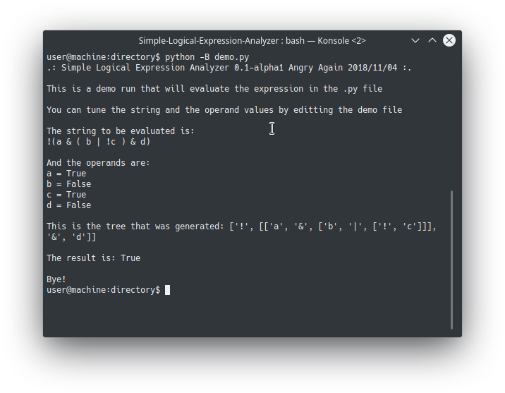

# Simple Logical Expression Analyzer



**[Português](#português)**  
* **[Aviso](#aviso)**
* **[Introdução](#introdução)**
* **[Pré requisitos](#pré-requisitos)**
* **[Utilização](#utilização)**
* **[Símbolos](#simbolos)**

**[English](#english)**  
* **[Warning](#warning)**
* **[Intro](#intro)**
* **[Requirements](#requirements)**
* **[Utilization](#utilization)**
* **[Symbols](#symbols)**

## Português
### Aviso
**Cuidado ao ler este readme, pois ele difere entre versões do programa. Veja sempre o arquivo readme incluído na release que você baixou. Este readme, em particular, é referente à versão 0.1-alpha2**

## Introdução
Simple Logical Expression Analyzer é, como o nome sugere, um analisador simples de expressões lógicas. Trata-se de um módulo em linguagem Python para avaliar expressões lógicas em texto. A ideia é que você possa usar uma expressão lógica externa à linguagem para tomar decisões dentro do código, lendo de um arquivo ou recebendo do usuário, e então utilizar seu resultado para algum objetivo.

A ideia de desenvolver partiu de um recurso para o **[1D-Sync](https://github.com/1deterministic/1D-Sync)**, para ser capaz de selecionar arquivos com base nas condições escolhidas pelo usuário. Com o **[SLEA](https://github.com/1deterministic/Simple-Logical-Expression-Analyzer)**, agora é possível identificar uma expressão lógica inteira de um atributo em arquivo `.json` e fazer a seleção com base nisso.

## Pré-requisitos
* **Python 3**
    * **Linux**: provavelmente já está incluído na sua distribuição. Apenas verifique o comando correto que executa a versão 3 (em algumas distros é `python` e em outras `python3`). Para verificar, rode esses comandos com o argumento **-V** e veja qual versão ele mostra
    * **Windows**: você pode rodar o instalador disponível no [site oficial](https://www.python.org/downloads/) ou instalar através do **[Chocolatey](https://chocolatey.org/)** com o comando 
        ```
        choco install python
        ```

## Utilização
* Adicione o módulo ao seu projeto
    * Copie a pasta `slea` para a raiz do seu projeto Python
    * Adicione a importação
        ```
        from slea import slea
        ```

* Avalie a sintaxe da string desejada com a função
    ```
    slea.evaluate_syntax(string)
    ```
    Essa função retorna um valor numérico inteiro correspondente ao índice do caractere onde um erro de sintaxe foi encontrado. Caso retorne um valor igual ao tamanho da string, nenhum erro foi encontrado. Você pode usar 
    ```
    if slea.evaluate_syntax(string) == len(string)
    ``` 
    por exemplo

* Monte a árvore sintática correspondente à string com a função
    ```
    slea.get_syntax_tree(string)
    ```
    Essa função retorna uma lista aninhada onde cada sublista corresponde a uma subárvore.

* Crie uma função que avalia os operandos. A função deve possuir retorno **True** ou **False** e ser capaz de avaliar todos os operandos necessários individualmente, que são recebidos no primeiro parâmetro. Você pode usar o segundo argumento para passar parâmetros para a função, caso queira. O arquivo `demo.py` inclui a seguinte função de exemplo:
    ```
    # values associated with the operands
        operands = {
            "a": True,
            "b": False,
            "c": True,
            "d": False,
        }

        # some function that will tell the values of the operands
        def value_of_example(operand, argument):
            # you can use 'argument' to pass the values of the operands
            # in this case I used a set
            try:
                return argument.get(operand)
            except Exception as e:
                return False
    ```

* Avalie o resultado da expressão lógica com a função 
    ```
    slea.evaluate_syntax_tree(syntax_tree, eval_function, argument)
    ```

    Essa função retorna **True** ou **False** de acordo com o valor resultante da expressão lógica, avaliada de acordo com a função recebida. `syntax_tree` é a árvore sintática gerada anteriormente, `eval_function` é a função customizada que será usada para julgar os operandos da expressão e `argument` é qualquer argumento que você queira usar na função customizada.

* Você pode executar e verificar o arquivo `demo.py` para ver uma implementação em funcionamento.

## Símbolos
* Operadores:
    * AND: `&`
    * OR: `|`
    * NOT: `!` (prefixo)

* Hierarquia:
    * Entrada: `(`
    * Saída: `)`

* Operandos: qualquer outro texto

* Os caracteres podem ser alterados no arquivo `slea/slea.py`

## English
### Warning
**Be careful when reading this readme because it differs between versions. Always read the readme file included in the release you downloaded. This particular readme refers to the version 0.1-alpha2**

## Intro
Simple Logical Expression Analyzer is, as the name suggests, a simple analyzer of logical expressions. It's a Python module to evaluate logical expressions in text. The idea is that you can use an external logical expression inside the code, reading it from a file or receiving from the user, and then use its result to some objective.

The idea to develop it came from a feature of **[1D-Sync](https://github.com/1deterministic/1D-Sync)**, to be capable of selecting files based on conditions given by the user. With **[SLEA](https://github.com/1deterministic/Simple-Logical-Expression-Analyzer)**, its now possible to identify an entire logical expression from a `.json` file attribute and then use it to decide what files to select.

## Requirements
* **Python 3**
    * **Linux**: probably its already included in your distro. Just double check the correct command that executes the version 3 (in some distros its `python` and in others its `python3`). To verify, run these commands with the **-V** argument and see what version it shows.
    * **Windows**: you can run the installer available in the [official website](https://www.python.org/downloads/) or install using **[Chocolatey](https://chocolatey.org/)** with the command
        ```
        choco install python
        ```

## Utilization
* Add the module to your project
    * Copy the folder `slea` to the root folder of your Python project
    
    * Add the import
        ```
        from slea import slea
        ```

* Check the syntax of the string with the function
    ```
    slea.evaluate_syntax(string)
    ```
    This function returns an integer numerical value corresponding to the index of the character where a syntax error was found. It will return the lenght of the string if no error was found. You can use
    ```
    if slea.evaluate_syntax(string) == len(string)
    ``` 
    to check if an error occurred, for instance

* Create the syntax tree from the string with the function
    ```
    slea.get_syntax_tree(string)
    ```
    This will return a nested list where each sublist corresponds to a subtree.

* Create a function that evaluates the operands. The function must return **True** or **False** and has to be capable of evaluating all necessary operands individually, wich are received in the first argument. You can use the second argument to pass arguments to the function, if you need. The file `demo.py` includes the following example:
    ```
    # values associated with the operands
        operands = {
            "a": True,
            "b": False,
            "c": True,
            "d": False,
        }

        # some function that will tell the values of the operands
        def value_of_example(operand, argument):
            # you can use 'argument' to pass the values of the operands
            # in this case I used a set
            try:
                return argument.get(operand)
            except Exception as e:
                return False
    ```

* Evaluate the logical expression with the function
    ```
    slea.evaluate_syntax_tree(syntax_tree, eval_function, argument)
    ```

    This function returns **True** or **False** according to the resulting value of the logical expression, evaluated according to the function received. `syntax_tree` is the syntax tree that was created previousy, `eval_function` is the custom function that will be used to judge the operands of the expression and `argument` is whatever argument you wish to use on your custom function.

* You can execute and verify the file `demo.py` to see a working implementation.

## Symbols
* Operators:
    * AND: `&`
    * OR: `|`
    * NOT: `!` (prefixo)

* Hierarchy:
    * In: `(`
    * Out: `)`

* Operands: any other text

* These characters can be changed in the file `slea/slea.py`

## [1deterministic](https://github.com/1deterministic), 2018
